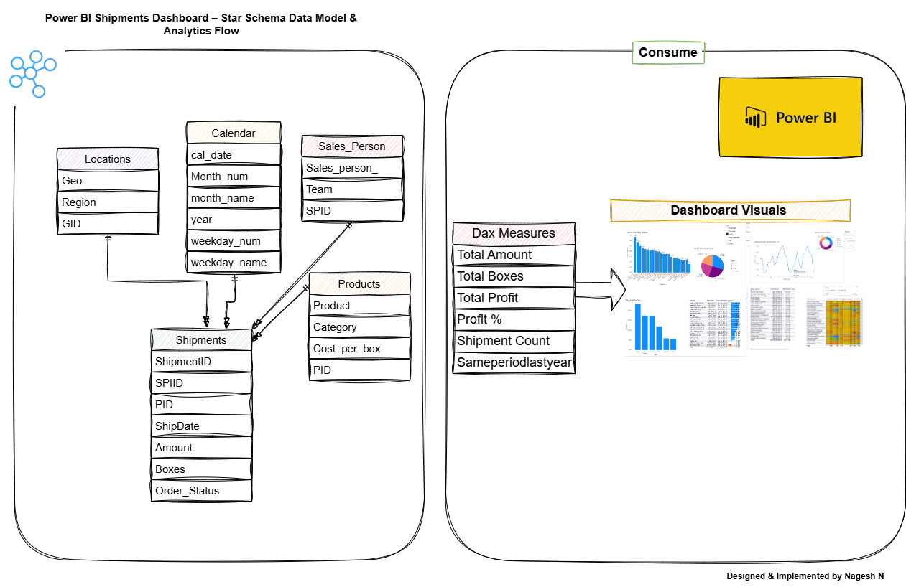
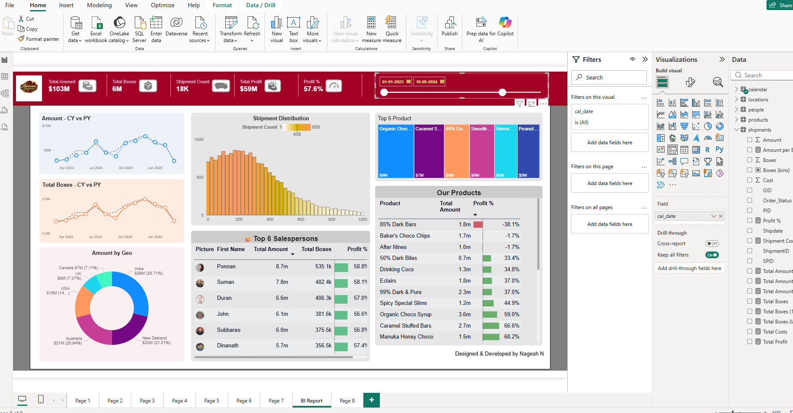
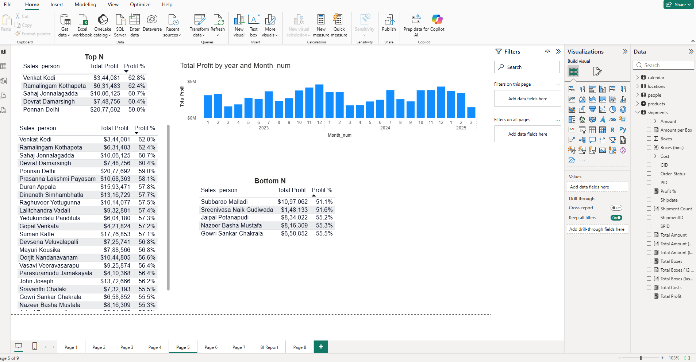

# 📊 Power BI Shipments Dashboard

A **Power BI dashboard** demonstrating shipments analysis using a **star schema** and **sample dataset**. Fully functional with **DAX measures**, visuals, and interactive reporting.

---

## 🏗 Star Schema Model



- **Fact Table:** `Shipments`  
- **Dimension Tables:** `Products`, `Sales_Person`, `Locations`, `Calendar`  

Optimized for **efficient analysis and reporting**.

---

## 📊 Dashboard Screenshots

### Overview



### Profit Analysis



---

## 🗂 Sample Dataset

File: `datasets/sample_shipments.xlsx`

**Sheets (Tabs):**

- **Shipments** → transactional fact table  
- **Products** → product details (Category, Cost per Box)  
- **Sales_Person** → salesperson info  
- **Locations** → region/country info  
- **Calendar** → date table for time intelligence  

> ⚠ Note: This is a **sample dataset**, but fully functional for analysis.

---

## 🔗 Relationships

- `Shipments[PID] → Products[PID]`  
- `Shipments[GID] → Locations[GID]`  
- `Shipments[SPID] → Sales_Person[SPID]`  
- `Shipments[Shipdate] → Calendar[cal_date]`  

This forms a **star schema**, ideal for Power BI reporting.

---

## 🧮 Key DAX Measures

```DAX
Total Amount = SUM(shipments[Amount])

Total Amount (Last Year) =
CALCULATE([Total Amount], SAMEPERIODLASTYEAR('calendar'[cal_date]))

Total Amount (12 Month Variance) =
VAR Ta_ly = [Total Amount (Last Year)]
RETURN IF(ISBLANK(Ta_ly), BLANK(), [Total Amount] - Ta_ly)

Total Boxes = SUM(shipments[Boxes])

Total Boxes (Last Year) =
CALCULATE([Total Boxes], SAMEPERIODLASTYEAR('calendar'[cal_date]))

Total Boxes (12 Month Variance) =
VAR Ta_ly = [Total Boxes (Last Year)]
RETURN IF(ISBLANK(Ta_ly), BLANK(), [Total Boxes] - Ta_ly)

Total Costs = SUM(shipments[Cost])

Total Profit = [Total Amount] - [Total Costs]

Profit % = DIVIDE([Total Profit], [Total Amount], 0)

Shipment Count = COUNTROWS(shipments)
```
---
## 🚀 How to Use
- Open Power BI Desktop
- Load the dataset: datasets/sample_shipments.xlsx
- Create relationships as defined in the star schema
- Apply DAX measures from dax_snippets/dax_measures.md
- Explore the interactive dashboard visuals

Works fully with sample data.

## 💡 Highlights
-  Clean star schema model for performance
-  Fully functional DAX measures for KPIs
-  Interactive dashboard with visual storytelling
-  Screenshots and Draw.io diagram included

## 📝 Personal Note

This dashboard was created by me, using online learning resources and hands-on practice.
It demonstrates:

- Power BI data modeling
- DAX calculations for KPIs
- Interactive visualization
- Dashboard storytelling

Even with sample data, the project is fully functional and showcases all core concepts.```
